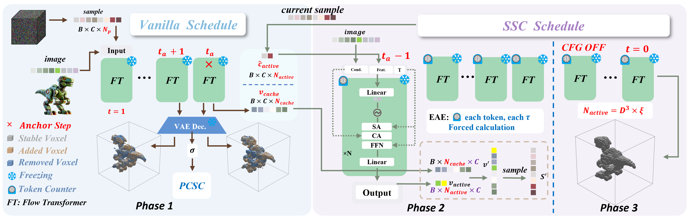

# Fast3Dcache: Training-free 3D Geometry Synthesis Acceleration

<div align="center">

[](https://arxiv.org/abs/2511.22533)
[](https://fast3dcache-agi.github.io/)
[](https://huggingface.co/spaces/Westlake-AGILab/Fast3Dcache)

**[Mengyu Yang](https://mulinjushi.github.io)**<sup>1,2</sup>, **[Yanming Yang](https://2hitee.github.io)**<sup>1</sup>, **[Chenyi Xu](#)**<sup>1</sup>, **[Chenxi Song](https://chenxi-song.github.io)**<sup>1</sup>, **[Yufan Zuo](#)**<sup>1</sup>, **[Tong Zhao](https://tongzhao1030.github.io)**<sup>1</sup>, **[Ruibo Li](https://scholar.google.com/citations?user=qtGY5T4AAAAJ&hl=zh-CN)**<sup>3</sup>, **[Chi Zhang](https://icoz69.github.io)**<sup>1,*</sup>

<sup>1</sup> AGI Lab, Westlake University  
<sup>2</sup> University of Electronic Science and Technology of China  
<sup>3</sup> Nanyang Technological University

<sup>*</sup> Corresponding author

🔥CVPR 2026
</div>

---

## 📖 Abstract

Diffusion models have achieved impressive generative quality across modalities like 2D images, videos, and 3D shapes, but their inference remains computationally expensive due to the iterative denoising process. While recent caching-based methods effectively reuse redundant computations to speed up 2D and video generation, directly applying these techniques to 3D diffusion models can severely disrupt geometric consistency. In 3D synthesis, even minor numerical errors in cached latent features accumulate, causing structural artifacts and topological inconsistencies. To overcome this limitation, we propose Fast3Dcache, a training-free geometry-aware caching framework that accelerates 3D diffusion inference while preserving geometric fidelity. Our method introduces a Predictive Caching Scheduler Constraint (PCSC) to dynamically determine cache quotas according to voxel stabilization patterns and a Spatiotemporal Stability Criterion (SSC) to select stable features for reuse based on velocity magnitude and acceleration criterion. Comprehensive experiments show that Fast3Dcache accelerates inference significantly, achieving up to a **27.12% speed-up** and a **54.8% reduction in FLOPs**, with minimal degradation in geometric quality as measured by **Chamfer Distance (2.48%)** and **F-Score (1.95%)**. 

## 🚀 Method

Our approach is motivated by the observation of a **Three-Phase Stabilization Pattern** in voxel occupancy during the denoising process.

<div align="center">
  
  </div>

### 1. Predictive Caching Scheduler Constraint (PCSC)
Instead of a fixed caching ratio, PCSC dynamically adjusts the caching budget over timesteps. It leverages the log-linear decay pattern of dynamic voxels to predict *how many* tokens can be safely cached at each step without harming the geometry structure.

### 2. Spatiotemporal Stability Criterion (SSC)
To determine *which* specific tokens to cache, SSC evaluates voxel stability from two perspectives:
* **Velocity Magnitude:** Reflects the intensity of feature updates.
* **Acceleration Criterion:** Quantify the potential error incurred by approximating the current velocity with the previous step.

By jointly considering these metrics, SSC identifies regions that have converged and can be safely reused.

## 🛠️ Installation

To set up the environment, please follow the steps below:

```bash
# 1. Clone the repository
git clone https://github.com/Westlake-AGILab/Fast3Dcache.git
cd Fast3Dcache

# 2. Create a virtual environment （ref: TRELLIS）
. ./setup.sh --new-env --basic --xformers --flash-attn --diffoctreerast --spconv --mipgaussian --kaolin --nvdiffrast
```

## ⚡ Inference

```bash
# Vanilla TRELLIS / fast3Dcache inference
cd fast3Dcache
sh inference.sh
# If you want to change tau, please click into selection.py
```
## 📊 Evaluation
```bash
# 1. throughput
cd evaluation
sh throughput.sh

# 2. FLOPs
sh flops.sh

#3. CD / F-Score
sh geometry.sh
```


## 📝 Citation

If you find our work useful for your research, please consider citing:

```bibtex
@misc{yang2025fast3dcachetrainingfree3dgeometry,
      title={Fast3Dcache: Training-free 3D Geometry Synthesis Acceleration}, 
      author={Mengyu Yang and Yanming Yang and Chenyi Xu and Chenxi Song and Yufan Zuo and Tong Zhao and Ruibo Li and Chi Zhang},
      year={2025},
      eprint={2511.22533},
      archivePrefix={arXiv},
      primaryClass={cs.CV},
      url={https://arxiv.org/abs/2511.22533}, 
}
```
